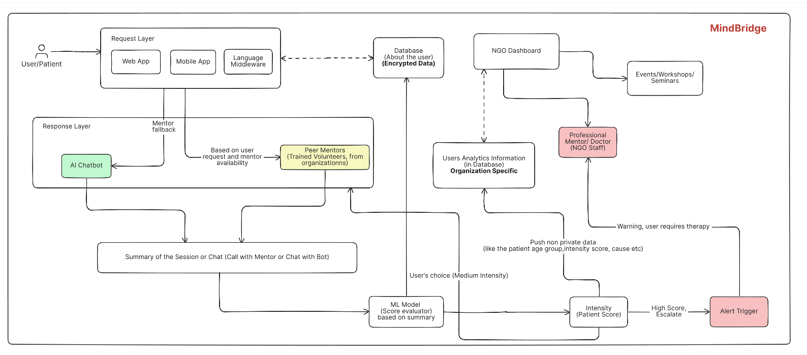

# 🧠 NeuroLyn: Adolescent Mental Health & Emotional Wellbeing

NeuroLyn is a comprehensive digital platform designed to provide early intervention and structured mental health support for adolescents. It bridges the gap between youth in need of emotional support and organizations (NGOs) equipped to provide it, all while offering a safe, stigma-free environment for expression.



## 🌟 Core Features

- **AI-Powered Wellbeing Tools**: Interactive AI chat interface for adolescents to express emotional concerns and receive immediate, empathetic support.
- **Peer & Professional Mentorship**: Secure channels for connecting youth with trained peer mentors and professional mental health experts.
- **Real-time Mood Tracking**: Sophisticated mood monitoring system that detects early warning signs and triggers necessary interventions.
- **NGO Dashboard**: Data-driven insights and analytics for organizations to monitor youth wellbeing, manage cases, and measure outreach impact.
- **ML-Driven Triage**: An intelligent pipeline that transcribes, summarises, and scores interactions to identify high-risk cases automatically.

## 🛠️ Technology Stack

### Frontend
- **Framework**: React 19 (Vite)
- **Styling**: Tailwind CSS, Framer Motion (Animations)
- **Visualization**: Recharts
- **Components**: Lucide React, Radix UI (via Tailwind components)
- **3D Elements**: Spline (@splinetool/react-spline)
- **Deployment**: Firebase (Hosting/Auth)

### Backend
- **Runtime**: Node.js
- **Framework**: Express.js
- **Database**: MongoDB (via Mongoose)
- **Authentication**: JWT & Firebase Auth integration
- **Real-time**: Socket.io (for live chat/sessions)

### ML Pipeline
- **Language**: Python 3.x
- **Core Tasks**: 
  - **Transcriber**: Audio-to-text processing.
  - **Summariser**: Extractive/Abstractive session summarization.
  - **Scorer**: Emotional intensity and risk scoring.
  - **Triage**: Automated case prioritization based on risk factors.

## 🚀 Getting Started

### Prerequisites
- Node.js (v18+)
- Python 3.8+
- MongoDB instance (Local or Atlas)
- npm or yarn

### Installation & Setup

1. **Clone the repository**:
   ```bash
   git clone https://github.com/your-username/MindBridge.git
   cd MindBridge
   ```

2. **Backend Setup**:
   ```bash
   cd backend
   npm install
   # Create a .env file based on .env.example
   npm run dev
   ```

3. **Frontend Setup**:
   ```bash
   cd ../Frontend
   npm install
   # Create a .env file based on .env.example
   npm run dev
   ```

4. **ML Pipeline Setup (Optional)**:
   ```bash
   cd ../ml_pipeline
   pip install -r requirements.txt
   # Configure environment variables in config.py
   ```

## 📂 Project Structure

```text
NeuroLyn/
├── Frontend/           # React frontend (Vite)
├── backend/            # Express.js backend API
├── ml_pipeline/        # Python-based ML processing scripts
├── architecture.png    # System architecture diagram
└── problem-statement.md # Project background and goals
```

## 🙏 Acknowledgements

*Inspiration**: Special thanks to the **Youngistaan NGO** for their impactful work in youth mental health and social change, which inspired the empathetic mission of this platform.
